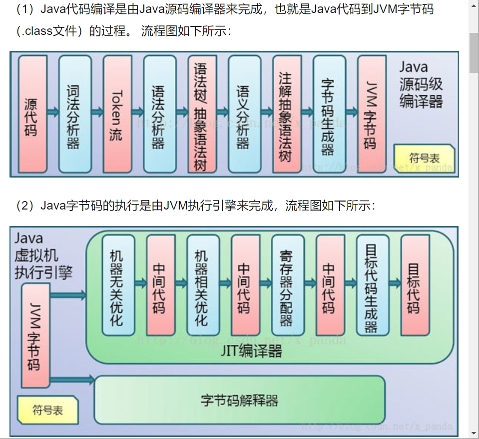
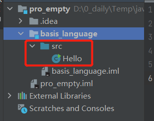

# Java_offer
it’s a repo for how to be a Java software engineer, hhh.

## run Hallo in cmd
public p是小写，Hello要和文件名字一样, **Java有大小区分**
快捷点 psvm 生成main，那一串；sout输出第3行那一串
文件的名称叫 Hello.java
1. javac Hello.java
    编译一个.class文件
2. java Hello.class/Hello
    运行输出了 Hallo
    
```java
public class Hello{
    public static void main (String[] args){
        System.out.print(" Hallo");
    }
}
```
编译型（直接翻译中文/compiler）/解释型（翻译官）--Java带有这两个特点
<p align="middle">
    
</p> 

## 注释

单行（//）/多行（/*注释*/）/文档（/** 注释 */）

关键字/标识符  
所有的标识符应该以字母（A-Z or a-z），美元符号（$），下划线（），对大小写敏感
**新建的class放到src下面才能运行**
<p align="middle">
    
</p> 

## 数据类型  

强类型语言--要求变量的使用严格符合规定。先定义在使用  
弱类型语言  
基本类型（primitive type） 

|整数类型|浮点类型|字符型|Boolean|
|--|--|--|--|
|byte（-128-127）|float（4个字节）|char（2个字节）|占1位（true/false）|
|short（-32768-32767）|double（8个字节）|
|int（----）|--|
|long（----）|--|

位 bit：是计算机内部数据存储的最小单位，二进制  
字节 byte：数据处理的基本单位，习惯写B             1B = 8 bit  
字符： 计算机中使用的字母/数字/字/符号  

```java
public class Hello {
    public static void main(String[] args) {
//        输出一个hallo
        int num1 = 10; //最常用
        byte num2 = 20;
        short num3 = 30;
        long num4 = 30L; //Long类型在数字后面加个L
//        浮点数
        float num5 = 50.1F; //float类型在数字后面加个F
        double num6 = 1.13456;
//        字符类型 char 是单引号，string是双引号
        char name = '啊';
        String na = "啊啊"; //String 不是关键字，是类
//        布尔值
        boolean flag = true;
        System.out.println("hallo");
    }
}

```
