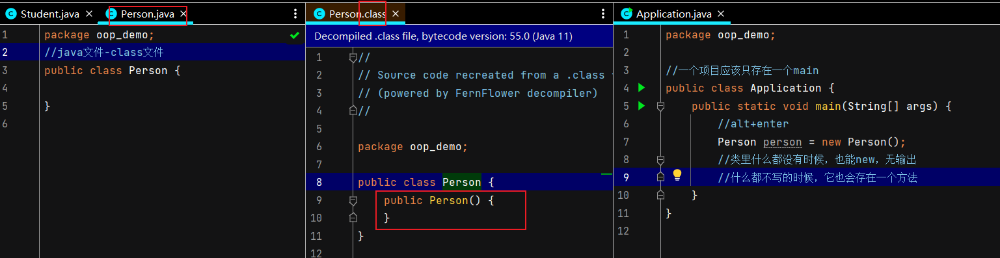

## 面向对象编程oop Object-Oriented Programming
面向过程：步骤清楚，面对过程适合处理一些较为简单的问题。  
面向对象：分类的思想，相同的问题分类。  
**以类的方法组织代码，以对象的组织（封装）数据**  
特征：封装/继承/多态  
//先有对象后有类，对象是具体的事物，类是抽象的  
return代表方法结束，break是循环跳出。  
```java
package oop;

import java.io.IOException;

//Demo01 类
public class Demo01 {
    //main 方法
    public static void main(String[] args) {

    }
    // 修饰符 返回值类型 方法名（参数）{
    // 方法体
    // return 返回值;
    // }
    public String say(){
        return "hallo";
    }

    //没有返回值
    public void hello(){
        return;
    }

    public int max(int a, int b){
        return a>b ? a:b; //三元运算符，a>b返回a
    }
    
    public void readfile(String file) throws IOException{
        //抛出异常
    }

}
```
## 方法调用
```java
package oop;

public class Demo02 {

    public static void main(String[] args) {
        // 静态方法 static
//        Student.say();
        // 非静态方法
//        Student student = new Student();
//        student.talk();

        //值传递
        int a = 1;
        System.out.println(a);
        Demo02.change(a);
        System.out.println(a);
        //输出都是1，没有改变a的值

        //引用传递
        //person是一个对象，指向的是类的地址，所以会改变
        Person person = new Person();
        System.out.println(person.name); // null
        Demo02.change(person);
        System.out.println(person.name); // alala
    }

    //这两个都是普通方法，a可以调用b
    //两个都是static也可以互相调用
    //一个是一个不是，不行
    //static 和类一起加载的
    //没有static的是类实例化才存在
    public void a(){
        b();
    }
    public void b(){

    }

    public static void change(int a){
        a = 10;
    }
    public static void change(Person a){
        a.name = "alala";
    }
}

//定义一个类，有一个属性name
class Person{
    String name;
}

package oop;

public class Student {
    public static void main(String[] args) {
        int res = new Student().add(2,3);
        System.out.println(res);
    }

    public int add(int a, int b){
        return a+b;
    }

    public static void say(){
        System.out.println("day");
    }
    public void talk(){
        System.out.println("uuuu");
    }
}
```
## 类与对象
类对某一事物整体描述/定义  
使用new关键字创建对象，这个时候除了分配内存空间外，还会给创建好的对象进行默认的初始化以及对类中构造器的调用。  
```java
package oop_demo;

public class Student {
    String name;
    int age;

    public void study(){
        System.out.println(this.name+" study");
        //this代表这个类
    }
}
package oop_demo;

//一个项目应该只存在一个main
public class Application {
    public static void main(String[] args) {
        //student对象是一个Student类的具体实列
        Student student = new Student();
        student.study(); //null 默认值
        student.name = "lala";
        student.study(); // 赋值了
    }
}
```
## 构造器详解
类中的构造器也成为构造方法，是在进行创建对象的时候必须要调用的。并且构造器有一下两个特点：必须和类的名字相同/必须没有返回类型，也不能写void.  
实例化初始值，debug能看到在new之后进入到了构造器里面。  
<p align="left">
    
</p>  

```java
package oop_demo;
//java文件-class文件
public class Person {
    String a;
    
    // 使用new关键字，本质实在调用构造器
    // 初始化值
    //alt+insert创建构造器
    
    //无参构造
    public Person() {
        this.a = "lalal";
    }
    //有参构造: 一定定义了有参构造，那无参构造必须显式定义
    public Person(String name){
        this.a = name;
    }
}

/*
public static void main(String[] args) {
        //alt+enter
        Person person = new Person("alalaa");
        //类里什么都没有时候，也能new，无输出
        //什么都不写的时候，它也会存在一个方法
        System.out.println(person.a); //alalaa
    }
 */
 ```
 ## 小结
 ```javal

//一个项目应该只存在一个main
public class Application {
    /*
    1. 类与对象
        类是一个模板：抽象，独享是一个具体的实列
    2. 方法
        定义，调用
    3. 对应用的引用
        引用类型：基本类型（8）
        对象是通过引用来操作的：栈--->堆
    4. 属性：字段Field成员变量
        默认初始化：
            数字： 0 0.0
            char: u0000
            boolean: false
            引用： null
        修饰符 属性类型 属性名 = 属性值 
    5. 对象的创建和使用
        -必须使用new 关键字创造对象：构造器 Pet p = new Pet()
        -对象的属性 p.name 
        -对象的方法 p.shout()
    6. 类：
        静态属性 属性
        动态行为 方法
    ‘封装，继承，多态’
     */
}
```
 
 ## 封装
 高内聚：类的内部数据操作细节自己完成，不允许外部干涉；  
 低耦合：仅暴露少量的方法给外部使用。  
 封装：应禁止直接访问一个对象中数据的实际表示，而应通过操作接口来访问，信息隐藏。  
 **属性私有，get/set()**  
 ```java
 package oop_demo;

public class Student {
    //属性私有
    private String name;
    private int age;
    private char sex;

    //提供一些可以操作这个属性的方法，get/set
    public String getName(){
        return this.name;
    }
    public void setName(String name){
        this.name = name;
    }
    
    //快捷键 alt+insert
    public int getAge() {
        return age;
    }

    public void setAge(int age) {
        this.age = age;
    }

    public char getSex() {
        return sex;
    }

    public void setSex(char sex) {
        this.sex = sex;
    }
}

/*
public static void main(String[] args) {
        Student s1 = new Student();
        s1.setName("lao");
        String s1Name = s1.getName();
        System.out.println(s1Name);
    }
 */
  ```
  
  ## 继承
  继承的本质是对某一批类的抽象，从而实现对显示世界更好的建模。  
  extends扩展，子类是父类的扩展。Java只有单继承。  
  继承是类和类之间的一种关系，除此之外，类和类之间的关系还有依赖，组合，聚合等。  
  继承关系的两个类，一个为子类/派生类，一个为父类/基类，子类继承父类，使用关键字extens。  
  子类和父类之间，从意义上讲应该具有“is a”的关系。  
  <p align="left">
    <Image src="pic/jicheng.png" width="948" height="222" />
  </p> 
  
  ## super
  1. super调用父类的构造方法，必须在构造方法的第一个。  
  2. super必须只能出现在子类的方法或者构造方法中。  
  3. super和this不能同时调用构造方法！  
  VS. this  
  1. 代表的对象不同，  
    this：本身调用这个对象  
    super：代表父类对象的应用  
 前提：  
    this：没有继承也可以使用  
    super：只能在继承条件才可以使用  
 构造方法：  
    this(); 本类的构造  
    super（）；父类的构造  

<p align="left">
    <Image src="pic/jicheng2.png" width="923" height="406" />
</p>  
