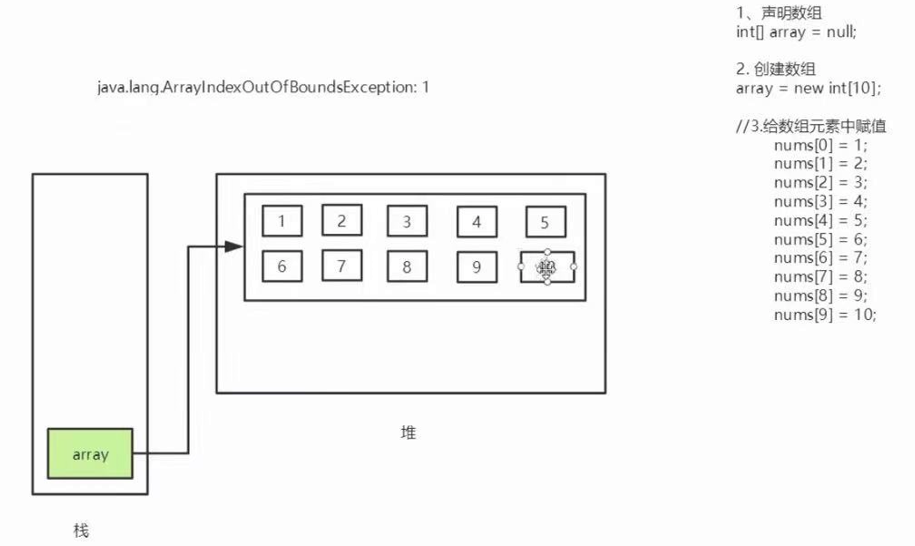
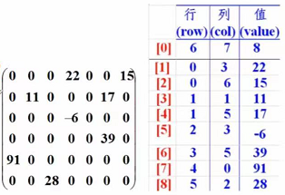

## 数组
数组是**相同类型的数据**的**有序**集合；数组描述的是相同类型的若干个数据，按照一定的先后次序排列组合而成；每个数据成为一个数组元素，每个数组元素可以通过一个下标（0）来访问。  

```java
datatype[] array; //首选
datatype array[]; //效果一样不是首选

datatype[] array = new datatype[arraysize];
array.length; 数组长度
```
```java
public class Demo01 {
    public static void main(String[] args) {
        int[] nums; //声明一个数组
        nums = new int[10]; // 创建一个数组
        int sum = 0;
        for (int i = 0; i < 10; i++) {
            nums[i] = i;
            sum+=i;
        }
        int l = nums.length;
        System.out.println(l);
        System.out.println(nums[0]+" "+sum);
//        int[] n = new int[10];

    }
}
```
## 内存分析
堆：存放new的对象和数组；可以被所有的线程共享，不会存放别的对象引用。  
栈：存档基本变量类型（包含这个基本类型的具体数据）；引用对象的变量（存放这个引用在堆里面的具体地址）。  
<p align='middle'>
     
</p> 

**长度是确定的**，一旦被创建，大小不能改变。  
元素必须相同类型，不能混合。  
数组中的原色可以是任何数据类型，包括基本类型和引用类型。  
数组变量属引用类型，数组也可以看成是对象，数组中的每个元素相当于该对象的成员变量。  
数组本身就是对象，Java中对象是在堆中的，因此数组无论保存原始类型还是其他对象类型，**数组对象本身实在堆中的**  
下标的合法区间：[0,length-1]  

## 数组使用
多维数组
```java
int a[][] = new int[2][3];
//二维数组a 两行3列
```

```java
public class Demo02 {
    public static void main(String[] args) {
        int[] a = {1,2,3,4,5};
//        for (int i = 0; i < a.length; i++) {
//            System.out.println(a[i]);
//        }
//        //查找最大元素
//        int max = 0;
//        for (int i = 0; i < a.length; i++) {
//            if(a[i]>max){
//                max = a[i];
//            }
//        }
//        System.out.println(max);
//        // 增强for循环，直接拿出来的就是数组里面的元素
//        for (int i : a) {
//            System.out.println(i);
//        }
//
//        printArray(a);

        int[] res = reverseArray(a);
        printArray(res);
      
        int[][] ar = {{1,2}, {3,4}, {5,6}, {7,8}, {9,0}};
        printArray(ar[0]);
        System.out.println(ar.length);
    }

    public static void printArray(int[] a){
        for (int i = 0; i < a.length; i++) {
            System.out.println(a[i]);
        }
    }

    public static int[] reverseArray(int[] a){
        int[] res = new int[a.length];
        for (int i = 0; i < a.length; i++) {
//            for(int i = 0, j = a.length-1; i<a.length; i++,j--){
            res[a.length-i-1] = a[i];
        }
        return res;
    }
}
```
## arrays类
import java.util.Arrays;
```java
        int[] a = {1,2,3,4,5,20,50,30,2,40,5,90};
        System.out.println(a);
        System.out.println(Arrays.toString(a));
        Arrays.sort(a); //在原数组上排序改变原始数组
        System.out.println(Arrays.toString(a));
```
## 冒泡排序
两两之间比较，时间复杂度O（n^2)， 两层循环  
```java
package arrayy;

import java.util.Arrays;

public class MaoPao {
    public static void main(String[] args) {
        int[] a = {2,4,1,8,2,4,8,0,4,6,2,8};
        int[] res = maoPao(a);
        System.out.println(Arrays.toString(res));
    }
    //冒泡排序
    //比较数组中，两个相邻元素，第一个比第二大 交换
    public static int[] maoPao(int[] a){
        int temp = 0;
        //单层循环， 判断我们这个要走几次 比较的次数 n-1
        for (int i = 0; i < a.length-1; i++) {
            //每次里面比较几次，由于最后一个肯定是排的最大/最小因此不用比了
            // n-1-i
            //内层循环，第一比第二大交换,第三方交换,最后一个是最大的话，再次比较不用比最后哪个了
            for (int j = 0; j < a.length-i-1; j++) {
                if (a[j+1]<a[j]){
                    temp = a[j+1];
                    a[j+1] = a[j];
                    a[j] = temp;
                }
            }

        }
        return a;
    }
}
```
## 稀疏数组
数组里面很多默认值是0/大部分是同一个值，无意义。  
首先 记住数组的行列，有多少不同值。把具有不同值的元素和行列及值记录在一个小规模的数组中，从而缩小程序规模。  
<p align='middle'>
     
</p> 

```java
package arrayy;

import java.util.Arrays;

public class XiShu {
    public static void main(String[] args) {
        int[][] ar1 = new int[5][5];
        ar1[1][2] = 1;
        ar1[2][3] = 2;
        for (int[] ints : ar1) {
            for (int anInt : ints) {
                System.out.print(anInt);
            }
            System.out.println();
        }
        //转换稀疏
        //获取有效值个数
        int count = 0;
        for (int[] ints : ar1) {
            for (int anInt : ints) {
                if (anInt!=0){
                    count++;
                }
            }
        }
        System.out.println(count);
        //创建稀疏
        int[][] ar2 = new int[count+1][3];
        ar2[0][0] = 5;
        ar2[0][1] = 5;
        ar2[0][2] = count;

        int row = 1;
        for (int i = 0; i < ar1.length; i++) {
            for (int j = 0; j < ar1[i].length; j++) {
                if (ar1[i][j]!=0){
                    ar2[row][0] = i;
                    ar2[row][1] = j;
                    ar2[row][2] = ar1[i][j];
                    row++;
                }
            }
        }
        for (int[] ints : ar2) {
            for (int anInt : ints) {
                System.out.print(anInt);
            }
            System.out.println();
        }
        //重建
        int[][] ar3 = new int[ar2[0][0]][ar2[0][1]];
        for (int i = 1; i < ar2.length; i++) {
            ar3[ar2[i][0]][ar2[i][1]]=ar2[i][2];
        }
        for (int[] ints : ar3) {
            for (int anInt : ints) {
                System.out.print(anInt);
            }
            System.out.println();
        }
    }
}
```
