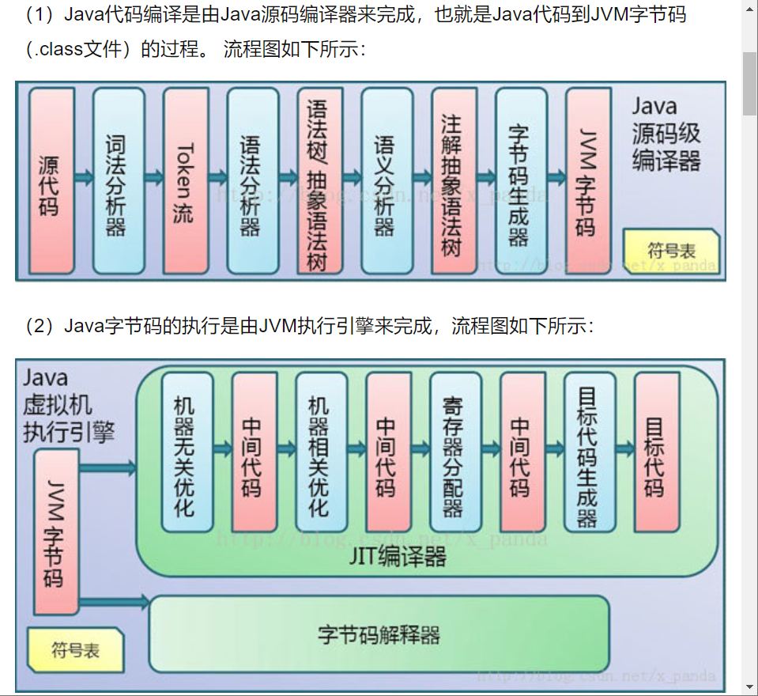
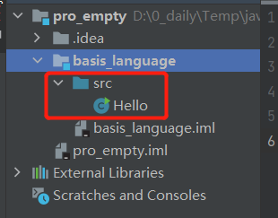

## run Hallo in cmd
public p是小写，Hello要和文件名字一样, **Java有大小区分**
快捷点 psvm 生成main，那一串；sout输出第3行那一串
文件的名称叫 Hello.java
1. javac Hello.java
    编译一个.class文件
2. java Hello.class/Hello
    运行输出了 Hallo
    
```java
public class Hello{
    public static void main (String[] args){
        System.out.print(" Hallo");
    }
}
```
编译型（直接翻译中文/compiler）/解释型（翻译官）--Java带有这两个特点
<p align="middle">
    
</p> 

## 注释

单行（//）/多行（/*注释*/）/文档（/** 注释 */）

关键字/标识符  
所有的标识符应该以字母（A-Z or a-z），美元符号（$），下划线（），对大小写敏感
**新建的class放到src下面才能运行**
<p align="middle">
    
</p> 

## 数据类型  

强类型语言--要求变量的使用严格符合规定。先定义在使用  
弱类型语言  
基本类型（primitive type） 

|整数类型|浮点类型|字符型|Boolean|
|--|--|--|--|
|byte（-128-127）|float（4个字节）|char（2个字节）|占1位（true/false）|
|short（-32768-32767）|double（8个字节）|
|int（----）|--|
|long（----）|--|

位 bit：是计算机内部数据存储的最小单位，二进制  
字节 byte：数据处理的基本单位，习惯写B             1B = 8 bit  
字符： 计算机中使用的字母/数字/字/符号  

```java
public class Hello {
    public static void main(String[] args) {
//        输出一个hallo
        int num1 = 10; //最常用
        byte num2 = 20;
        short num3 = 30;
        long num4 = 30L; //Long类型在数字后面加个L
//        浮点数
        float num5 = 50.1F; //float类型在数字后面加个F
        double num6 = 1.13456;
//        字符类型 char 是单引号，string是双引号
        char name = '啊';
        String na = "啊啊"; //String 不是关键字，是类
//        布尔值
        boolean flag = true;
        System.out.println("hallo");
    }
}

```

## 数值的表示
```java
public class inter_extra {
    public static void main(String[] args) {
        //整数扩展：进制，二进制0b，十进制，八进制0，十六进制0x
        int i = 10;
        int i2 = 010;
        int i3 = 0x10;
        System.out.println(i);
        System.out.println(i2);
        System.out.println(i3);
//        浮点数，银行业务用float表示钱， 所以银行用BigDecimal 数学工具类
        float f = 0.1f;
        double d = 1.0/10;
        System.out.println(f==d);//输出false
        System.out.println(f);
        System.out.println(d);

        float d1 = 2312323443f;
        float d2 = d1+1;
        System.out.println(d1==d2);//true
//        float 有限 离散 舍入误差 大约 接近但不等于  最好完全避免浮点数进行比较
//        double

//        字符 所有字符都是数字，char设计编码问题，Unicode 2字节 65536（2^16）
        char c1 = 'a';
        char c2 = '中';
        System.out.println(c1);
        System.out.println((int)c1);//97
        System.out.println(c2);
        System.out.println((int)c2);//20013

        //U0000 UFFFF
        char c3 = '\u0061';
        System.out.println(c3);

        //转义字符 \t 是 tab \n 换行
        // 布尔
        boolean flag = true;
        if (flag){}
        //if (flag == true){} 一般新手这样，双重确定
    }
}
```

## 类型转换
```java
public class type_conver {
    public static void main(String[] args) {
        // 低-----高
        // byte, short, char, int, long, float, double
        int i = 128;
        byte b = (byte) i;
        System.out.println(i);//128
        System.out.println(b);//-128 内存溢出了，最大是127
        // 加括号是强制转换  高--低 强制
        // 低--高 自动转换
        double d = i;
        System.out.println(d);//128.0

        /**
         * 不能对布尔类型转换
         * 不能把对象类型转换成不相干的类型
         * 在把高容量转换到低容量的时候，强制转换
         * 转换的时候可能存在内存溢出，或精度问题
         */
        System.out.println((int)23.7); //double 23
        System.out.println((int)-45.89f); // float -45

        char c = 'a';
        int r = c + 1;
        System.out.println(r); //98
        System.out.println((int)r); //b

        //操作比较打的时候，注意溢出的问题
        int money = 10_0000_0000;
        int year = 20;
        int to = money * year; //-1474836480 操作溢出了
        long to2 = money * year; //-1474836480 结果一样，因为是先保存int 计算完之后才是long
        System.out.println(to2);
        long to3 = money * (long)year; //20000000000
        System.out.println(to3);
        //L l 小写会被看成1

    }
}
```
## 变量
所有变量，方法，类名：见名知意  
类成员变量：首字母小写和驼峰原则：除第一个单词意外，后面都大写 monthSalary  
局部变量，方法名：首字母小写和驼峰原则：runRun()  
常量：大写字母和下划线：MAX——VALUE  
类名：首字母大写和驼峰原则，Many，GoodMoring  
```java
import com.sun.jdi.Type;
import com.sun.jdi.Value;
import com.sun.jdi.VirtualMachine;

public class value {
    // main方法， 还可以定义属性
    // 类变量 static
    static double salary = 2500; //类内直接引用 不用初始化class
    // 实列变量
    // 局部变量
    //实列变量：从属于对象/类，有默认值，0，null，false
    String name;
    int age;

    //常量 final 这个单词的位置不区分前后，修饰符
    static final double pi = 3.14;

    public static void main(String[] args) {
        // Java 是一个强类型语言，每个变量都必须声明其类型，指定空间
        //Java变量是程序中最基础的存储单元，其要素包括变量名，变量类型和作用域
        // type varName [=value] [{, varName[=value]}] 不建议一行定义多个值
        //每个变量都有类型，类型可以是基本类型，也可以是引用类型，合法标识符
        //int a,b,c; //不建议这样

        // 局部变量，必须声明和初始化
        int a=1, b=2, c=3;
        String name = "lala";
        char x = 'X';
        double pi = 3.14;

        //变量类型 变量名字 = new value（）; 自动初始化实列变量
        value Value = new value();
        System.out.println(Value.age);

        //类变量
        System.out.println(salary);
    }

    // 其他方法
    public void add(){

    }

}
```
## java [运算符](https://www.runoob.com/java/java-operators.html?_t_t_t=0.3133259497117251)  
算术运算符\关系运算符\位运算符\逻辑运算符\赋值运算符\条件运算符\扩展赋值运算符  
```java
public class operator {
    public static void main(String[] args) {
        // 二元运算符 ctrl+d 复制当前行到下一行
        int a = 10;
        int b = 10;
        int c = 10;
        int d = 10;
        System.out.println(a+b);
        System.out.println(a-b);
        System.out.println(a*b);
        System.out.println(a/b);
        System.out.println(a/(double)b);

        //按类型优先级自动转换，参与运算中最高的类型的等级转换
        long m = 12212312L;
        int n = 123;
        short f = 10;
        byte r = 8;
        System.out.println(a+b+c+d);// long
        System.out.println(b+c+d); // int
        System.out.println(c+d); // int

        // 关系运算符 布尔值
        int q = 10;
        int w = 20;
        int e = 21;
        System.out.println(e%q);// e/q 21/10 =2..1
        System.out.println(q>w);
        System.out.println(q<w);
        System.out.println(q==w);
        System.out.println(q!=w);
    }
}
```

自增运算符/自减  
```java
public class self_add {
    public static void main(String[] args) {
        // ++ --
        // a++ 先赋值在运算
        // ++a 先运算在赋值
        int a = 2;
        int b = a++;
//        a = a+1 //这句没有执行，隐藏代码，但是执行了
        System.out.println(a);//3
//        a = a+1
        int c = ++a;

        System.out.println(a);//4
        //System.out.println(a);//4
        System.out.println(b);//2
        //System.out.println(b);//2
        System.out.println(c);//4
        //System.out.println(c);//4

        // 幂运算 2^3, 很多运算使用工具类运算
        double u = Math.pow(2,3);
        System.out.println(u);
    }
}
```
逻辑运算符
```java
public class logic_op {
    public static void main(String[] args) {
        boolean a = true;
        boolean b = false;
        System.out.println("a && b "+(a&&b)); //与运算，都为真 - 真
        System.out.println("a || b "+(a||b)); // 或运算 一个为真 - 真
        System.out.println("!(a && b) "+!(a&&b)); // 真变假
        //短路运算，第一个条件为假后面的条件就不执行了
        //测试如果执行，c会自增1
        int c = 5;
        boolean r = (c<4)&&(c++<4);
        System.out.println(r);
        System.out.println(c);//5 没有增加，所以短路了

        // 位运算
        /*
        * A=0011 1100
        * B=0000 1101
        * A&B = 0000 1100
        * A|B = 0011 1101
        * A^B =
        * ~B
        * << 左移*2 >> 右移➗2
        * 0000 0000   0
        * 0000 1000   8
        *
        * */

        // 三元运算符
        int d = 10;
        int f = 20;
        d+=f; // d = d+f
        d-=f; // d = d-f
        System.out.println(d);
        System.out.println(""+d+f); //字符串会把后面的东西穿在一起   1020
        System.out.println(d+f+""); // 30 字符串在前面会穿 在后面会运算

        // x ? y:z
        //如果x == true 则结果为y, 否则结果为z
        int score = 80;
        String type = score < 60 ? "no":"yes";
        System.out.println(type);
    }
}
```
