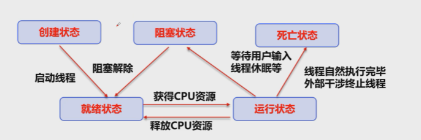
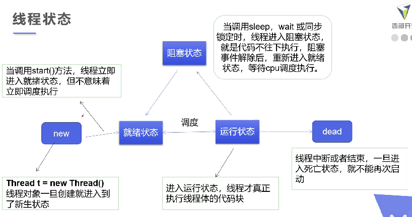
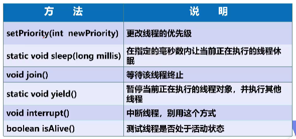

## 静态代理
```java
package thread;
/*
真实对象和代理对象都要实现同一个接口
代理对象要代理真实角色
代理对象可以做很多真实对象做不了的，真实线程比较专注
 */
public class StaticAg {

    public static void main(String[] args) {
        new Thread(()-> System.out.println("love")).start();

        Agent agent = new Agent( new You() );
        agent.happyMarry();
    }
}

interface Marry{
    void happyMarry();
}

class You implements Marry{
    @Override
    public void happyMarry() {
        System.out.println("happy");
    }
}

class Agent implements Marry{
    //代理真实目标角色
    private Marry target;

    public Agent(Marry target) {
        this.target = target;
    }

    @Override
    public void happyMarry() {
        before();
        this.target.happyMarry();
        after();
    }

    private void after() {
        System.out.println("buzhi");
    }

    private void before() {
        System.out.println("weikuan");
    }
}
```

## lamda表达式
避免匿名内部类定义过多  
functional interface函数式接口  
定义：任何接口，如果只包含**唯一**一个抽象方法，那么它就是一个函数式接口；对于函数式接口，我们可以通过lambda表达式创建该接口的对象。  
```java
public interface Runnable{
  public abstract void run();
}```

```java
package thread;

public class TestLambda {
    //静态内部类
    static class Like2 implements iLike{
        @Override
        public void lambda() {
            System.out.println("lambd222a");
        }
    }

    public static void main(String[] args) {
        Like iLike = new Like();
        iLike.lambda();

        Like2 like = new Like2();
        like.lambda();

        //局部内部类
        class Like3 implements iLike{
            @Override
            public void lambda() {
                System.out.println("lamb3333da");
            }
        }
        Like3 like3 = new Like3();
        like3.lambda();


        //匿名内部类，没有类的名称，必须借助接口或父类
        iLike like4 = new iLike() {
            @Override
            public void lambda() {
                System.out.println("44444");
            }
        };
        like4.lambda();

        //lambda
        iLike like5 = () -> {
            System.out.println("5555");
        };
        like5.lambda();
    }

}

//定义一个函数式接口
interface iLike{
    void lambda();
}

////实现类
class Like implements iLike{
    @Override
    public void lambda() {
        System.out.println("lambda");
    }
}
```

## 线程状态

<p align="left">
    
   
    
</p> 

有些方法被废弃了，不让使用了。建议使用一个标志位进行终止flag。  
```java
package thread;

public class TestStop implements Runnable{
    //测试stop，主干是重写run 还有一个 主函数
    //建议线程正常停止，利用次数，不建议死循环
    //建议使用标志位
    //不要使用stop destroy

    private boolean flag = true;

    @Override
    public void run() {
        int i = 0;
        while (flag){
            System.out.println("thread "+ i++);
        }
    }

    public void stop(){
        this.flag=false;
    }


    public static void main(String[] args) {
        TestStop testStop = new TestStop();
        new Thread(testStop).start();
        for (int i = 0; i < 1000; i++) {
            System.out.println("main "+i);
            if (i==900){
                testStop.stop();
                System.out.println("stop");
            }
        }
    }
}
```

## 线程休眠
sleep(time)指定当前线程阻塞的毫秒数，1000=1s；  
sleep存在异常InterruptedException；  
sleep时间达到后线程进入就绪状态；  
sleep可以模拟网络延时，倒计时等；  
每个对象都有一个锁，sleep不会释放锁。  
```java
package thread;

import java.text.SimpleDateFormat;
import java.util.Date;

//放大问题的发生性
public class TestSleep {
    public static void main(String[] args) throws InterruptedException {
        Date date = new Date(System.currentTimeMillis()); //获取系统当前时间
        while(true){
            Thread.sleep(1000);
            System.out.println(new SimpleDateFormat("HH:mm:ss").format(date));
            date = new Date(System.currentTimeMillis());
        }

    }
}
```

## 线程礼让 yield
礼让线程，让当前正在执行的线程暂停，但不堵塞。  
将线程从运行状态转为就绪状态。  
让cpu重新调度，礼让不一定成功，看cpu心情。  
```java
package thread;

public class TestSleep {
    public static void main(String[] args) {
        MyYield myYield = new MyYield();
        new Thread(myYield,"a").start();
        new Thread(myYield,"b").start();
    }
}

class MyYield implements Runnable{
    @Override
    public void run() {
        System.out.println(Thread.currentThread().getName()+" kaishi");
        Thread.yield();
        System.out.println(Thread.currentThread().getName()+" jieshu");
    }
}
/*
a kaishi
b kaishi
a jieshu
b jieshu
 */
 ```
 ## 线程强制执行 join
  join合并线程，待此线程执行完成后，在执行其他线程，其他线程阻塞  
  可以想象成插队  
  ```java
  package thread;

public class TestJoin implements Runnable{
    @Override
    public void run() {
        for (int i = 0; i < 100; i++) {
            System.out.println("join lll"+ i);
        }
    }

    public static void main(String[] args) throws InterruptedException {
        //启动我们的线程
        TestJoin testJoin = new TestJoin();
//        new Thread(testJoin).start();
        Thread thread = new Thread(testJoin);
        thread.start();

        //主线程
        for (int i = 0; i < 100; i++) {
            if(i==20){
//                new Thread(testJoin).join();
                thread.join();
            }
            System.out.println("main " + i);
        }
        
    }
}
```

## 线程状态观测
Thread.State 可以处在一下某个之一：  
new：尚未启动的线程处于此状态。  
Runnable： 在Java虚拟机中执行的线程处于此状态。  
Blocked：被阻塞等待监视器锁定的线程处于此状态。  
Waiting：正在等待另一个线程执行特定动作的线程处于此状态。  
Time_Waiting：正在等待另一个线程执行动作达到指定等待时间的线程处于此状态。  
Terminated：已推出的线程处于此状态。  
一个线程可以子啊给定时间点处于一个状态，这些状态是不反应任何操作系统线程状态的虚拟机状态。  
```java
package thread;

public class TestState {
    public static void main(String[] args) throws InterruptedException {
        Thread thread = new Thread(()->{
            for (int i = 0; i < 5; i++) {
                try {
                    System.out.println("for xun huan " + i);
                    Thread.sleep(1000);
                } catch (InterruptedException e) {
                    e.printStackTrace();
                }
            }
            System.out.println("////");
        });

        //观察状态
        Thread.State state = thread.getState();
        System.out.println(state); //new一个

        //强制启动后
        thread.start();
        state = thread.getState();
        System.out.println(state); //run

        while(state!=Thread.State.TERMINATED){ //只要线程不重质，就一直输出
            Thread.sleep(1000);
            state = thread.getState();//更新判断条件
            System.out.println(state);
        }
    }
}
```

## 线程优先级 priority
Java提供一个线程调度器来监控程序中启动后进入就绪状态的所有线程，线程调用器按照优先级决定应该调用哪个线程。  
线程的优先级用数字表示，范围1-10.  
```java
Thread.MIN_PRIORITY=1;
Thread.MAX_PRIORITY=10;
Thread.NORMAL_PRIORITY=5;
//改变或获取优先级
getPriority()  setPriority(int xx);
```
优先级低只是以为着获得调度的概率低，并不是优先级低就不会被调用了，看CPU调度。  
```java
package thread;

public class TestPriority {
    //主线程默认优先级
    public static void main(String[] args) {
        System.out.println(Thread.currentThread().getName()+"name"+Thread.currentThread().getPriority());
        MyPriority myPriority = new MyPriority();
        Thread t1 = new Thread(myPriority);
        Thread t2 = new Thread(myPriority);
        Thread t3 = new Thread(myPriority);
        Thread t4 = new Thread(myPriority);
        Thread t5 = new Thread(myPriority);
        Thread t6 = new Thread(myPriority);

        //先设置优先级，在启动
        t1.start();

        t2.setPriority(1);
        t2.start();

        t3.setPriority(3);
        t3.start();

        t4.setPriority(6);
        t4.start();

        t5.setPriority(4);
        t5.start();

        t6.setPriority(8);
        t6.start();

    }
}

class MyPriority implements Runnable{
    @Override
    public void run() {
        System.out.println(Thread.currentThread().getName()+"name"+Thread.currentThread().getPriority());
    }
}
```


