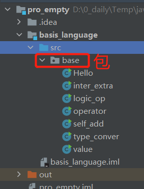
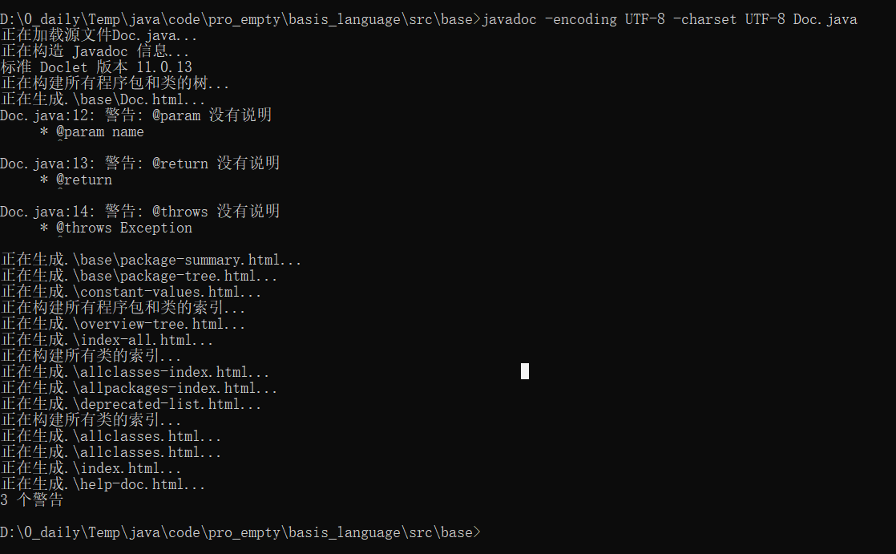
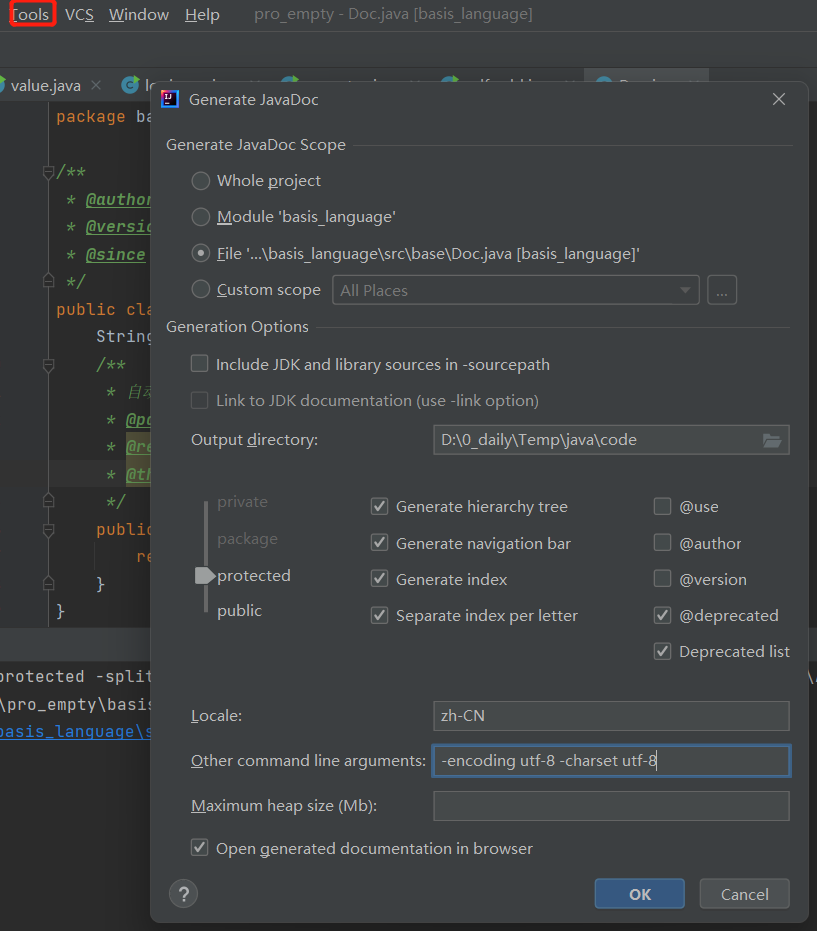

## package
为了更好地组织类，Java提供了包机制，用于区别类名的命名空间  
本质是文件夹，一般是公司域名为包名，包里面的名字尽量不要重复    
```java
(import) package pkg1[. pkg2[. pkg3...]];
```
<p align="middle">
    
</p> 

## Java doc
javadoc 命名使用开生成自己API文档  
参数：  
@author 作者名		@version 版本号		@since 指明需要最早使用的jdk版本		@param 参数名		@return 返回值情况		@throws 异常抛出情况  
[jdk11 帮助文档](https://docs.oracle.com/en/java/javase/11/)  
<p align="left">
    
	  
</p> 

## java控制流
next(): 一定要读取到有效字符才可以阶数输入；对输入有效字符之前遇见的空白，next会自动去掉；只有输入有效字符后才将其后面输入的空白作为分隔符或结束符；**next不能得到带有空格的字符串**  
nextline(): 以enter为结束，以回车键之前所有输入为输出
```java
package base;

import java.util.Scanner;

public class Flow {
    public static void main(String[] args) {
//        scanner 对象 程序和人的交互 java.util.Scanner
//        Scanner s = new Scanner(System.in);
//        通过Scanner类的next()与nextLine()方法获取输入的字符串
//        在读取前我们一般需要使用hasNext(), hasNextLine()判断是否还有输入的数据
        Scanner s = new Scanner(System.in);
        System.out.println("output ");
        if (s.hasNext()){
//	if (s.hasNextLine()){ //这个if没关系，可以不用就是试试
            String str = s.next(); // 用next的输出 “hallo a” 只有“hallo"
	    String str1 = s.nextLine(); // 输出正常的 hallo a
            System.out.println("out " + str);
        }
        s.close(); //用完关掉，IO流不关就会一直占用资源

    }
}
```
```java
import java.util.Scanner;
//输入多个数字，求其总和和平均数，每输入一个数字回车确认，非数字结束，并输出
public class Flow_test {
    public static void main(String[] args) {
        Scanner s = new Scanner(System.in);
        double sum = 0;
        int m = 0;

        while(s.hasNextDouble()){
            double d = s.nextDouble();
            m = m+1;
            sum = sum + d;
        }
        System.out.println(sum+" "+ sum/m);

        s.close();
    }
}
```

## 顺序结构
一句一句执行
## 选择结构
if单选/if双选/if多选/嵌套if/switch
```java
if(boolean){
boolean==true执行}
```
```java
package flow;

import javax.sql.rowset.spi.SyncResolver;
import java.util.Scanner;

public class Choice {
    public static void main(String[] args) {
        //单选
//        Scanner s = new Scanner(System.in);
//        String str = "qe";
//        String scanner = s.nextLine();
//        if (scanner.equals(str)){ //String的相等不能用'=='
//            System.out.println(scanner);
//        }
//        System.out.println("end");
//        s.close();

        //考试大于60ok 双选
//        Scanner scanner = new Scanner(System.in);
//        int score = scanner.nextInt();
//        if (score>60){
//            System.out.println("ok");
//        }else{
//            System.out.println("no");
//        }

        //多选
//        Scanner scanner = new Scanner(System.in);
//        int score = scanner.nextInt();
//        if (score==100){
//            System.out.println("100");
//        }else if (score<100 && score > 60){
//            System.out.println("yes");
//        }else if (score<60 && score > 0){
//            System.out.println("yes0");
//        }else{
//            System.out.println("buheguize");
//        }

        //switch case语句
//        反编译  java-class---反编译
        char grade = 'C';
//        String str = "laa"// 字符串也可以了
        switch (grade){
            case 'A':
                System.out.println("yes");
                break; //可选 如果下面不写，则会每个case挨个输出
            case 'C':
                System.out.println('u');
//            case 'laa':
//                System.out.println("str");
            default:
                System.out.println("ll");
        }

    }
}
```
## 循环结构
while / do ... while/  for  
大多数情况是会让循环停止下来，需要一个让表达式失效的语句
```java
package flow;

public class WhileTest {
    public static void main(String[] args) {
//        while
        int i = 0;
        int sum = 0;
//        while(i<101){
//            sum = sum+i;
//            i++;
//            System.out.println(sum);
//        }
        
//        do while 至少执行一次
        do{
            sum = sum+i;
            i++;
        }while(i<101);
        System.out.println(sum);
    }
}
```
